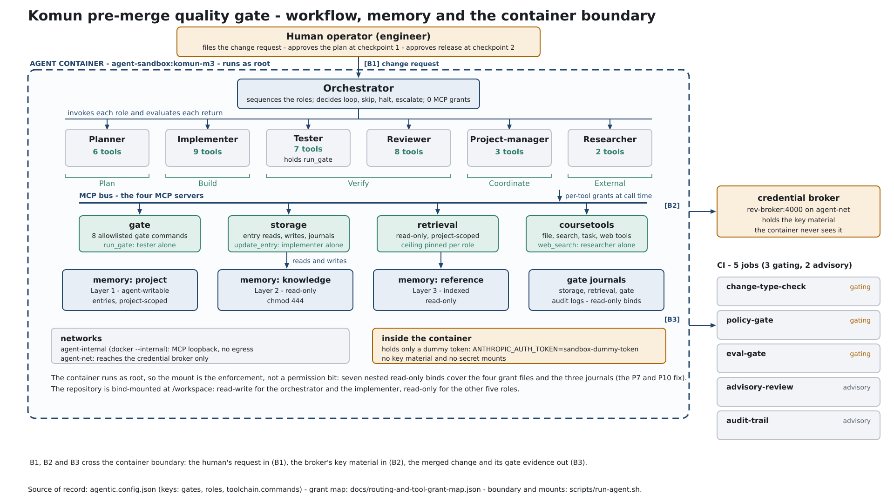
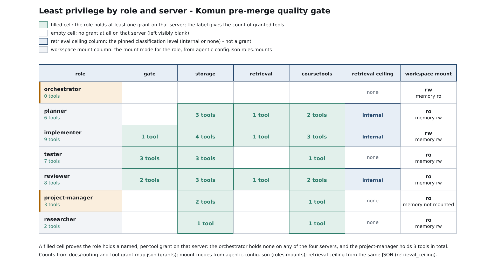
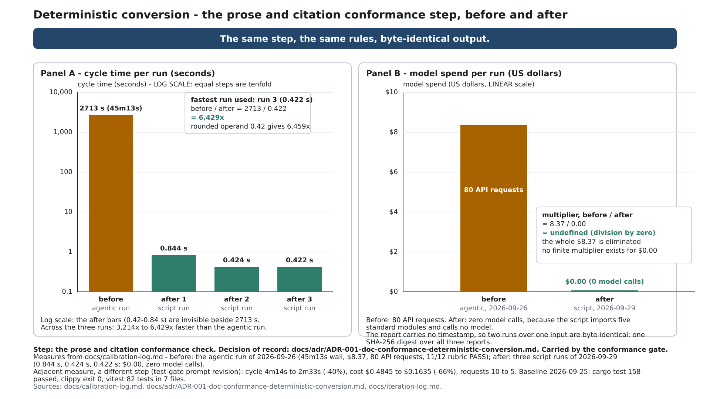

<!-- _class: lead -->

# Komun Pre-Merge Quality Gate

## Seven governed roles, four MCP servers, seven deterministic gates over one real codebase

A pre-merge gate that checks every change against Komun: Rust, PostgreSQL, and a SvelteKit front end.

---

## The problem, and the baseline

- 1 conformance pass by an agent cost 45m13s of wall clock and $8.37 of model spend.
- 158 Rust tests must pass (20 komun-core, 138 komun-server), measured 2026-09-25.
- 82 web tests across 7 files must pass (`npx vitest run`), same date.
- `cargo clippy --release -- -D warnings` exits 0 with zero lints.
- `npm run check` reports 0 errors and 0 warnings.
- 3 defect classes recurred even when the agent was told to quote its evidence.

---

## What a merge used to cost vs now

| Item | Before | Now |
| --- | --- | --- |
| Conformance pass wall clock | 45m13s (2,713 s) | 0.844s, 0.424s, 0.422s |
| Model spend per pass | $8.37 | $0.00 |
| Model requests per pass | 80 API requests | 0 |
| Test-gate prompt cycle | 4m14s | 2m33s |
| Test-gate prompt cost | $0.4845 | $0.1635 |

---

## Architecture overview

- 1 launcher (`scripts/run-agent.sh`) starts any role behind one interface.
- 7 roles, 4 MCP servers, 1 read-only console, 3 memory layers.
- 7 deterministic gates plus 1 write-mode fix run before merge.

---

## The architecture on one page

---

## The seven roles and their boundaries

| Role | Job | Boundary |
| --- | --- | --- |
| orchestrator | runs the ordered steps | workspace read-write, memory read-only |
| planner | plans the change | workspace read-only, memory read-write |
| implementer | writes code | workspace and memory read-write, only role with fmt-fix |
| tester | runs the gates | workspace read-only, only role that may run a gate |
| reviewer | reads the journal and records a verdict | workspace read-only, memory read-write |
| project-manager | opens and closes the ticket | workspace read-only, no memory mount |
| researcher | gathers evidence | workspace read-only, memory read-write |

---

## The four MCP servers

- 1 gate server is the only path that executes a command, and it accepts allowlisted gate names only.
- 1 storage server writes memory entries and journals every call.
- 1 retrieval server reads against an allow-list and journals every call.
- 1 coursetools server offers codebase search and course helpers.
- 4 servers, each with its own allow-list and its own audit journal.

---

## The deterministic gate set

| Gate | Command | Mode |
| --- | --- | --- |
| test | cargo test --workspace | check |
| clippy | cargo clippy --release --all-targets -- -D warnings | check |
| fmt | cargo fmt --check | check |
| policy | pytest eval/test_policy.py eval/test_deterministic_step.py | check |
| conformance | python3 scripts/run-conformance-gate.py | check |
| webcheck | npm --prefix web run check | check |
| webtest | npm --prefix web run test | check |
| fmt-fix | cargo fmt --all | write, implementer only |

---

## A live run, what the console shows

- 1 read-only console (`rev/console/`) shows the run and never writes the repository.
- 3 screens: FLOW, LIVE, INSPECT.
- 8 ordered orchestration steps, with 2 human checkpoints marked as decisions.
- 4 evidence sources on the checkpoint card, each labelled with its own age.
- 1 key approves a checkpoint (Enter); 1 key opens the ruling chooser (`e`).
- Last 20 gate-journal rows and the live process table are read, never cached without their age.

---

## Governance: the least-privilege matrix

| Role | workspace | memory | build cache |
| --- | --- | --- | --- |
| orchestrator | rw | ro | ro |
| planner | ro | rw | ro |
| implementer | rw | rw | ro |
| tester | ro | rw | rw |
| reviewer | ro | rw | ro |
| project-manager | ro | none | ro |
| researcher | ro | rw | ro |

---

## Least privilege, by role and by server

---

## Red-team probe result

- 10 probes (P1 to P10) were run against the enforcement boundaries.
- 8 were blocked on the first run.
- 2 were not blocked on the first run: P7 and P10.
- 2 failed at the same layer, the container mounts.
- 7 nested read-only binds were added over the workspace and memory binds.
- 10 of 10 probes are blocked after the fix; 1 reuse check now requires them read-only.

---

## Evaluation and calibration

- 8 iteration-log runs (001 to 008) from 2026-09-24 to 2026-09-30.
- 10 near-miss patterns (NM-1 to NM-10) recorded in the calibration log.
- 2 dev runs (D1, D2) and 2 holdout runs (H1, H2) in the 2026-09-29 regression.
- 1 12-point rubric: the before-conversion documentation pass scored 11 of 12.
- Every near-miss maps to the governance control it argues for.

---

## The four-run end-to-end regression

| Run | Type | Wall clock | Outcome |
| --- | --- | --- | --- |
| D1 | dev | 2323s | reviewer verdict; test gate exit 101 (156 passed, 2 failed) caught |
| D2 | dev | 1592s | reviewer verdict |
| H1 | holdout | 1698s | reviewer verdict |
| H2 | holdout | 1438s | reviewer verdict |

Total 7,051s, about 1.96 hours. `fmt` stayed red in all 4 runs, pre-existing at HEAD and unattributed.

---

## Right-tool decisions: agent, deterministic, or human

| Work | Owner | Why |
| --- | --- | --- |
| Prose and citation conformance | deterministic script | rule set never changes; same input, same output |
| Judgement against acceptance criteria | reviewer agent | not specifiable as a rule set |
| Plan approval and release approval | human checkpoint | accountability stays with a person |

1 step was converted from agent to deterministic in this cycle.

---

## Before and after the conversion

- 2,713 s of agent time replaced by a 0.42s process launch, about 6,400 times faster.
- $8.37 of model spend replaced by $0.00.
- 164,438 output tokens replaced by 0 model calls.
- 3 runs produced 1 SHA-256 digest (15f1c690...), so reports are byte-identical.
- 299 citations checked, 289 resolved at the cited line, 10 findings.

---

## The conversion, charted

---

## Impact: what changed and what it cost

- $8.37 removed per conformance run, replaced by $0.00.
- 66% off the test-gate prompt cost ($0.4845 to $0.1635) and 40% off its cycle time.
- 90 policy tests now gate every change (75 permission plus 15 validator).
- 2 failed tests in D1 were caught before merge by the test gate.
- 0 model calls in the converted step, and 10 citation findings surfaced.

---

## Operations: controls, escalation, rollback, limits

- 1 hard stop keeps the memory layers read-only, and 3 journals record every MCP call.
- 2 human checkpoints and a `halt` ruling are the escalation path.
- 1 `git revert` of the conversion commit is the rollback, documented in ADR-001; not yet exercised.
- 5 CI jobs: change-type-check, policy-gate, eval-gate, advisory-review, audit-trail.
- Limits, stated plainly: `fmt` red at HEAD (unattributed); 2 known conformance false positives; no cost figure for the four-run regression; the sandbox protects nothing if the host is compromised.

---

## What is next

- Fix the 2 wrapped-literal false positives so the conformance gate can fail clean.
- Attribute the pre-existing `fmt` failures so the fmt gate can go green.
- Add per-run cost reporting to the broker so the regression can be costed.
