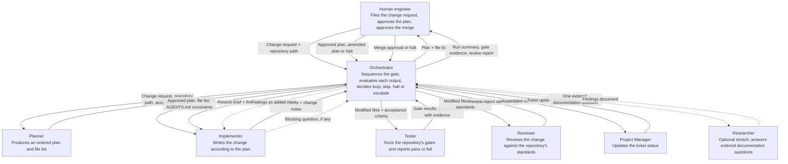

# Orchestration Diagram — Komun Pre-Merge Quality Gate

Which roles does the pre-merge quality gate pass through, and in what order?

## Diagram

Which boxes and arrows carry the handoffs of this gate?

## Alt text

What does this diagram show to a reader who cannot see it?

Boxes stacked top to bottom show the order of work, and the Orchestrator sits at the top. The Orchestrator calls every other role and writes orchestration documents only, never production code. The Planner returns an ordered plan and a file list, and a human approves them at Checkpoint 1 before any code is written. The Implementer returns modified files, the Tester returns gate results, and the Reviewer returns a review report. A solid arrow carries a passing change on to the Project Manager, and a dashed loop carries failing gate results or review findings back to the Implementer. A second human approves release at Checkpoint 2, and a dashed branch shows the optional Researcher invoked only on an external-documentation blocker.

## Handoff summary

In what order does the Orchestrator hand work to the next role?

1. The Orchestrator invokes the `planner` with the change request, the repository path and the acceptance criteria.
2. The Orchestrator sends the ordered plan and file list to the human for Checkpoint 1, plan approval.
3. The Orchestrator sends the approved plan, the file list and the `AGENTS.md` constraints to the `implementer`.
4. The Orchestrator sends the modified files and the acceptance criteria to the `tester`.
5. The Orchestrator sends the modified files and the repository's review standards to the `reviewer`.
6. The Orchestrator returns failing gate results or review findings to the `implementer` as a rework brief, and repeats to the loop limit.
7. The Orchestrator sends the assembled run summary to the `project-manager`.
8. The Orchestrator sends the run summary, the gate evidence and the review report to the human for Checkpoint 2, release approval.
9. In the optional stretch flow, the Orchestrator invokes the `researcher` only when another role raises an external-documentation blocker.

## Which gates run before a merge?

Which commands must pass, and what does each one prove?

- Run `cargo test --workspace` and require a green suite (`AGENTS.md:196` `cargo test --workspace`).
- Run `cargo clippy --release -- -D warnings` and require zero warnings (`AGENTS.md:197` `cargo clippy --release -- -D warnings`).
- Run `cargo fmt --check` from the workspace root (`setup.md:82` `cargo fmt --check`).
- Run `npm run check` inside `web/` and require zero errors and zero warnings (`AGENTS.md:205` `npm run check` `→` `0 errors, 0 warnings`).
- Run `npx vitest run` inside `web/` and require every suite green (`AGENTS.md:206` `npx vitest run` `→` `82 tests in 7 files, all passing`).

The Tester reports each command with its exit status and its output, and the Orchestrator halts the loop when any gate stays red (`AGENTS.md:197` `must stay at zero warnings`).

## Where do the gates run?

Where does the Tester run the gate commands, and against which mount?

- Run the gates inside the agent sandbox, where the repository is mounted at `/workspace` (`setup.md:408` `` `/home/computing/rev` is mounted at `/workspace` ``).
- Read project memory from `/workspace/.memory` (`docs/iteration-log.md:488` `` mounted that directory over `/workspace/.memory/` ``).
- Build the WASM package first, because the frontend gates need it (`AGENTS.md:160` `# build (wasm first!)`; `AGENTS.md:161` `wasm-pack build crates/wasm --target web`).

## What must the Implementer never change?

Which repository rule does the rework loop enforce?

- Follow the append-only migration rule: never edit `migrations/001_schema.sql`, and add `002+` for any schema change (`AGENTS.md:115-116` `Schema changes are additive files`).
- Expect exactly three migration files in `migrations/` (`migrations/` → `001_schema.sql`, `002_directory_open_registration.sql`, `003_drop_matches_message.sql`).
- Keep the prose standard in step with any doc change, because `docs/DOC-STYLE.md` governs it (`AGENTS.md:149` `Keep the prose docs in sync with the code`).
